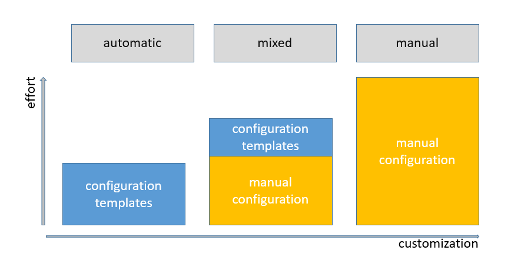

# Kibana Buildpack for Cloud Foundry

**WARNING**: This is work in progress, do not use in production.

This buildpack allows to deploy [Kibana](https://www.elastic.co/products/kibana) as an app in Cloud Foundry.


## Use Cases




### Use Case "automatic"


> You want to automatically connect to an Elasticsearch service.

In this case you have nothing to configure. Just deploy an empty `Kibana` file and use a Cloud Foundry `manifest.yml` file where you bind a service instance with your app. 

The buildpack is only able to do a connection if exactly one service of the same service type (Elasticsearch) is bound to the app. The buildpack finds the service by comparing the service tags (they should be set as "elasticsearch' or "elastic"). 


### Use Case "manual":

> You don't want to use pre-defined templates and you deliver all Kibana config files in the expected file structure as described later. You are still able to deliver additional plugins and certificates but you are responsible for the service bindings.

When you deliver config files in the "conf.d" folder no pre-defined templates are applied. 

#### Example `manual Kibana` file:

```
plugins:
- x-pack
certificates:
- elasticsearch
```


### Use Case "mixed":


> You want to use only some of pre-defined templates and you deliver also some own Kibana config files in the expected file structure. Depending of which templates you use you are responsible for the service bindings or not. You are able to deliver additional plugins and certificates.

When you deliver config files in the "conf.d" folder no pre-defined templates are applied by default. If you still want to use some pre-defined templates you have to explicitly define them in the "Kibana" file.

#### Example `mixed Kibana` file with automatic binding:

```
config-templates:
- name: cf-kibana
  service-instance-name: my-elasticsearch
plugins:
- x-pack
certificates:
- elasticsearch
```


## Usage

### Kibana Cloud Foundry App

A Kibana Cloud Foundry App has the following structure:

```
.
├── certificates
│   └── elasticsearch.crt
├── conf.d
│   ├── my-kibana.yml
│   ├── my-additional-kibana-setting.yml
│   └── my-xpack-settings.yml
├── plugins
│   └── x-pack-6.0.0.gem
├── Kibana
└── manifest.yml
```

#### Kibana

The `Kibana` file in the root directory of the app is required. It is used by the buildpack to detect if the app is in fact a Kibana app. Furthermore it allows to configure the buildpack / the deployment of the app in yaml format.

The following settings are allowed:

* `certificates`: additional certificates to install (array of certificate names, without file extension). Defaults to none.
* `cmd-args`: Additional command line arguments for Kibana. Empty by default
* `config-templates`: Defines which config templates should be used (array). Defaults to none  
* `config.templates.name`: Name of a pre-defined config template
* `config.template.service-instance-name`: Service Instance Name to which should be connected 
* `heap-percentage`: Percentage of memory (Total memory - reserved memory) which can be used by the heap memory: Default is 75
* `node-options`: Additional node-js arguments. Empty by default 
* `plugins`: Additional plugins to install (array of plugin names). Defaults to none. If you are in a disconnected environment put the plugin binaries into the plugin folder.
* `reserved-memory`: Reserved memory in MB which should not be used by heap memory. Default is 300
* `version`: Version of Kibana to be deployed. Defaults to 6.0.0

##### Currently available templates:

```
cf-kibana:
- defines listening port
- connects to cf elasticsearch service-instance
```

#### Example `Kibana` file:

```
version: 6.0.0
cmd-args: ""
node-options: ""
reserved-memory: 300
heap-percentage: 75
config-templates:
- name: cf-kibana
  service-instance-name: my-elasticsearch
plugins:
- x-pack
certificates:
- elasticsearch
```


#### manifest.yml

This is the [Cloud Foundry application manifest](https://docs.cloudfoundry.org/devguide/deploy-apps/manifest.html) file which is used by `cf push`.

This file may be used to set the service binding


#### certificates folder

Put any additional required certificate in this folder. They will be added to the node-js cacert truststore used by Kibana. You don't have to do further configuration in the Kibana config files. 

#### conf.d folder
In the folder `conf.d` the [Kibana](https://www.elastic.co/guide/en/kibana/current/index.html) configuration is provided. The folder is optional. All files in this directory are used as part of the Kibana configuration.
Prior to the start of Kibana, all files in this directory are processed by [dockerize](https://github.com/jwilder/dockerize) as templates.
This allows to update the configuration files based on the environment variables provided by Cloud Foundry (e.g. VCAP_APPLICATION, VCAP_SERVICES).

The supported functions for the templates are documented in [dockerize - using templates](https://github.com/jwilder/dockerize/blob/master/README.md#using-templates)
and [golang - template](https://golang.org/pkg/text/template/).


#### plugins

Put any additional required plugin (*.gem or *.zip) in this folder. Also define them in the Kibana file. 


### Deploy App to Cloud Foundry

To deploy the Kibana app to Cloud Foundry using this buildpack, use the following command:

```
cf push -b https://github.com/swisscom/cf-buildpack-kibana.git
```


You find more details in the [Cloud Foundry documentation](https://docs.cloudfoundry.org/devguide/services/log-management.html)


## Limitations

* This buildpack is only tested on Ubuntu based deployments.


### Building the Buildpack (for developers and cf admins

To build this buildpack, run the following command from the buildpack's directory:

1. Source the .envrc file in the buildpack directory.

   ```bash
   source .envrc
   ```
   To simplify the process in the future, install [direnv](https://direnv.net/) which will automatically source .envrc when you change directories.

1. Install buildpack-packager

    ```bash
    (cd src/go/vendor/github.com/cloudfoundry/libbuildpack/packager/buildpack-packager && go install)
    ```

1. Build the buildpack

    ```bash
    buildpack-packager [ --cached | --uncached ]
    ```

1. Use in Cloud Foundry

   Upload the buildpack to your Cloud Foundry and optionally specify it by name

    ```bash
    cf create-buildpack [BUILDPACK_NAME] [BUILDPACK_ZIP_FILE_PATH] 1
    cf push my_app [-b BUILDPACK_NAME]
    ```

### Testing (TODO)

Buildpacks use the [Cutlass](https://github.com/cloudfoundry/libbuildpack/cutlass) framework for running integration tests.

To test this buildpack, run the following command from the buildpack's directory:

1. Source the .envrc file in the buildpack directory.

   ```bash
   source .envrc
   ```
   To simplify the process in the future, install [direnv](https://direnv.net/) which will automatically source .envrc when you change directories.

1. Run unit tests

    ```bash
    ./scripts/unit.sh
    ```

1. Run integration tests

    ```bash
    ./scripts/integration.sh
    ```

More information can be found on Github [cutlass](https://github.com/cloudfoundry/libbuildpack/cutlass).


### Acknowledgements

Inspired by the [Heroku buildpack](https://github.com/heroku/heroku-buildpack-go) and the [Go(Lang) Buildpack](https://github.com/cloudfoundry/go-buildpack)
